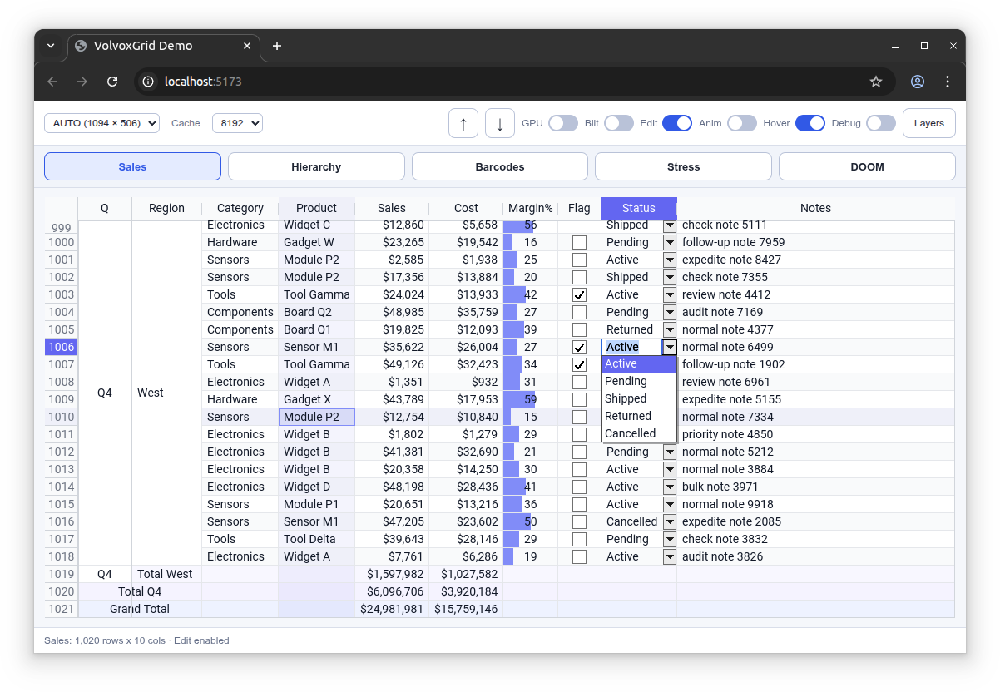
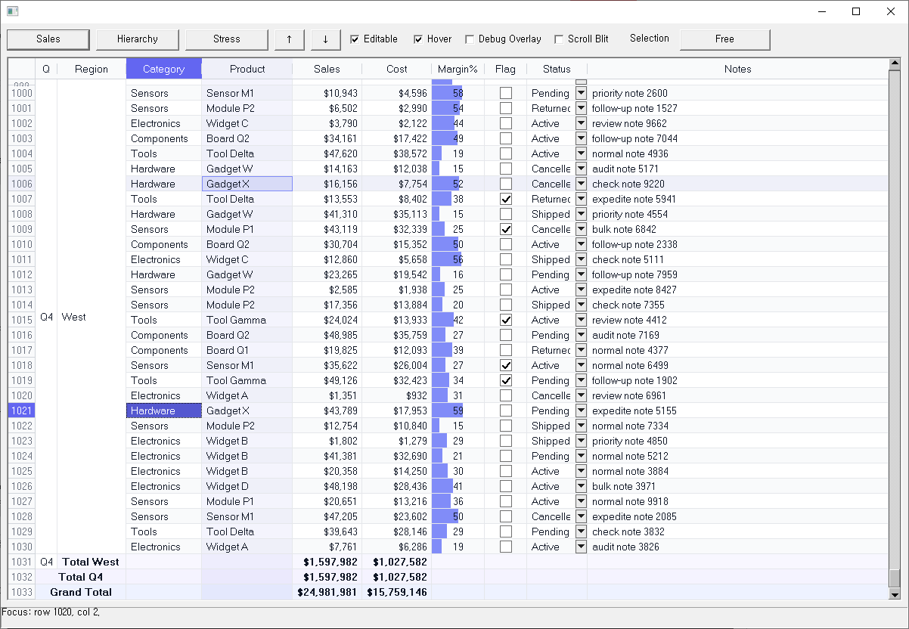
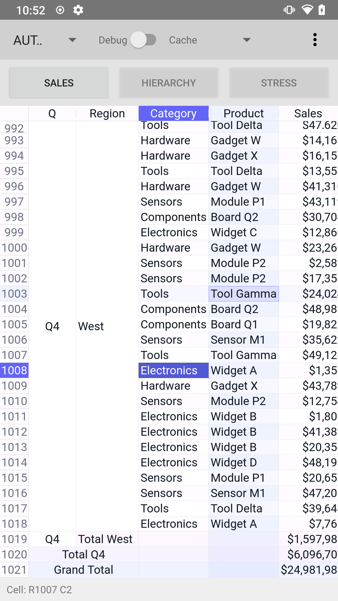
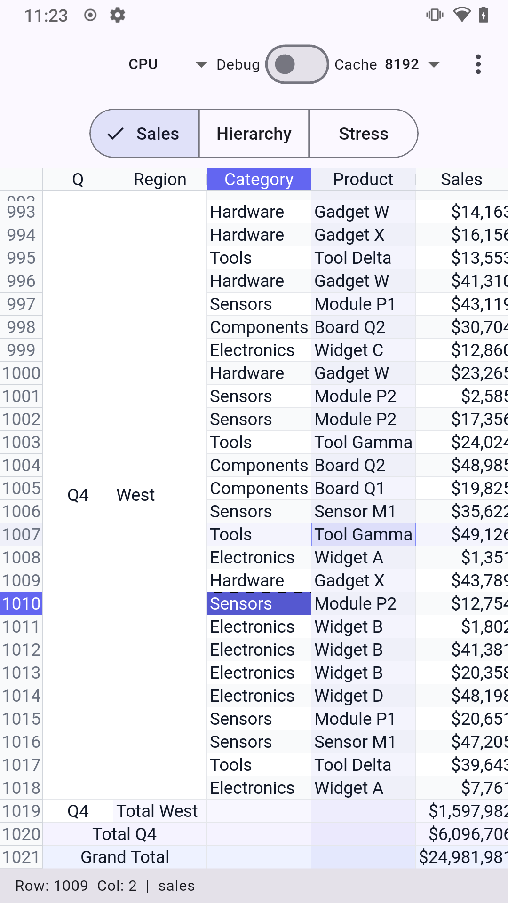
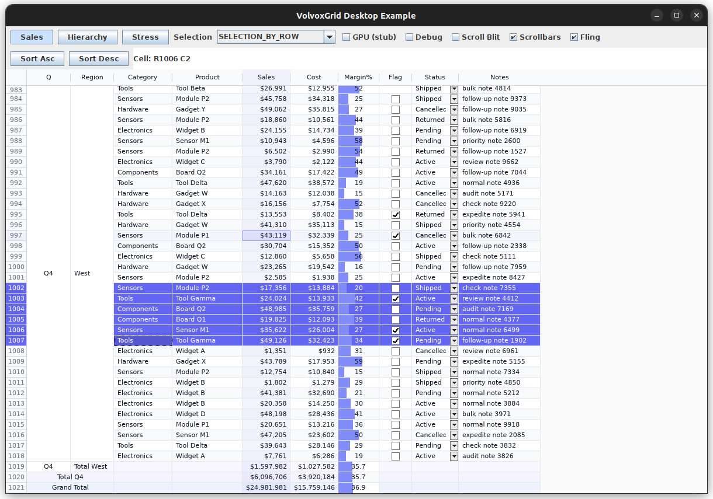
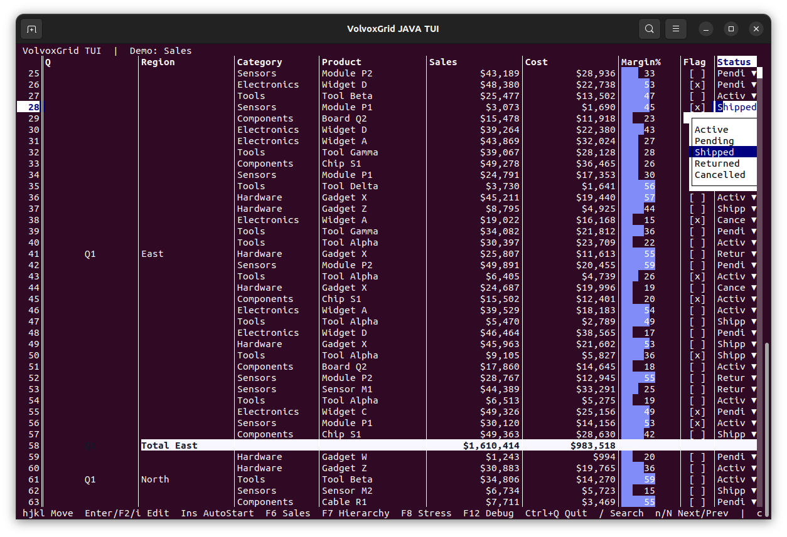
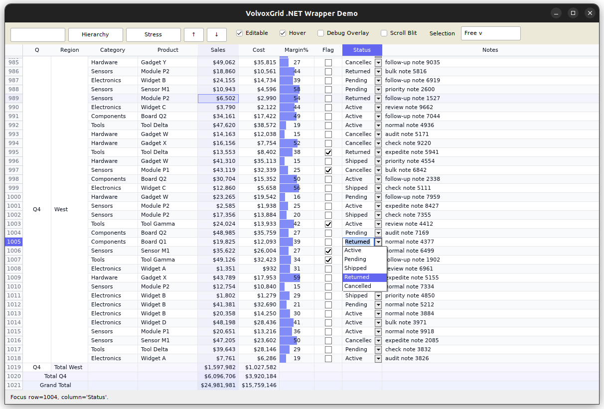
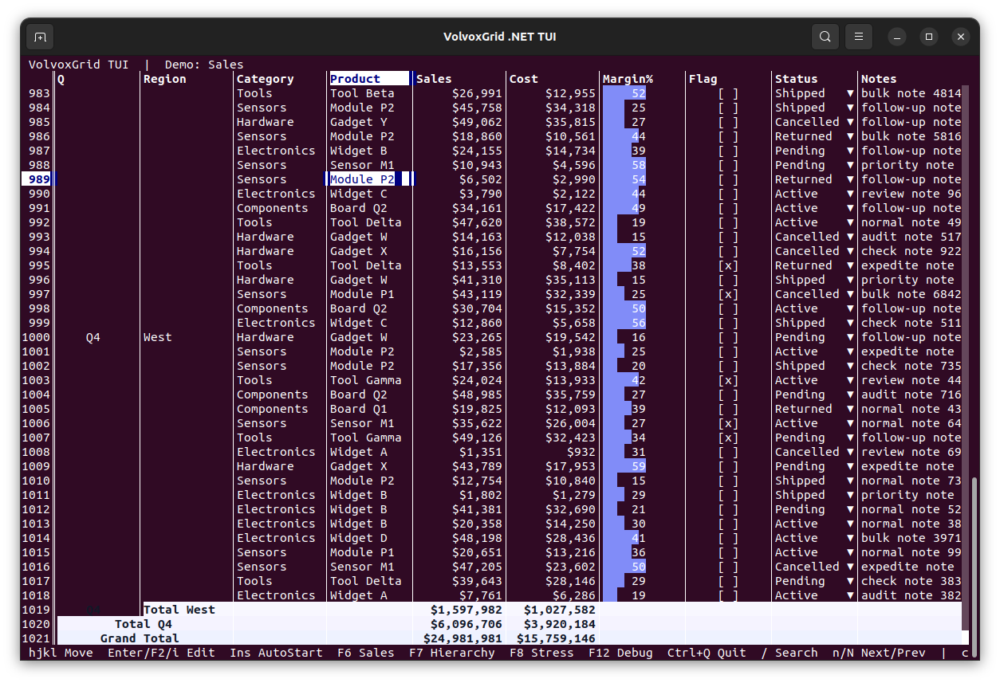
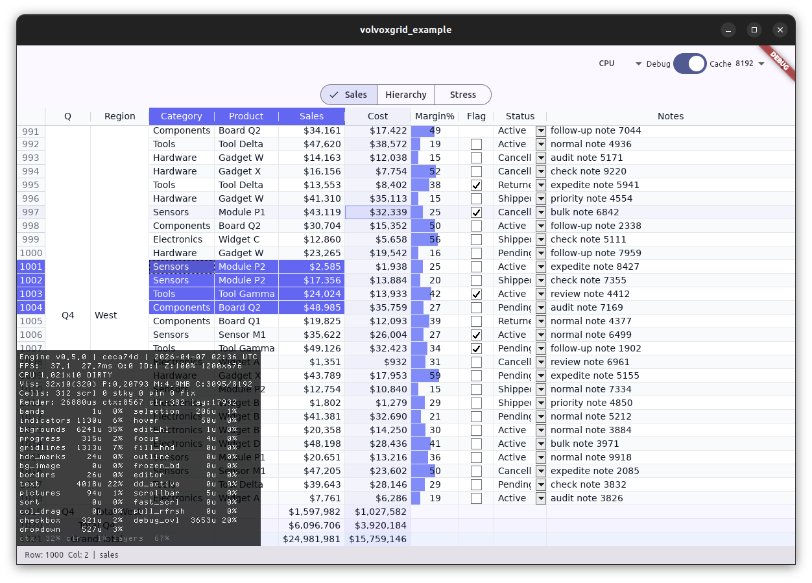
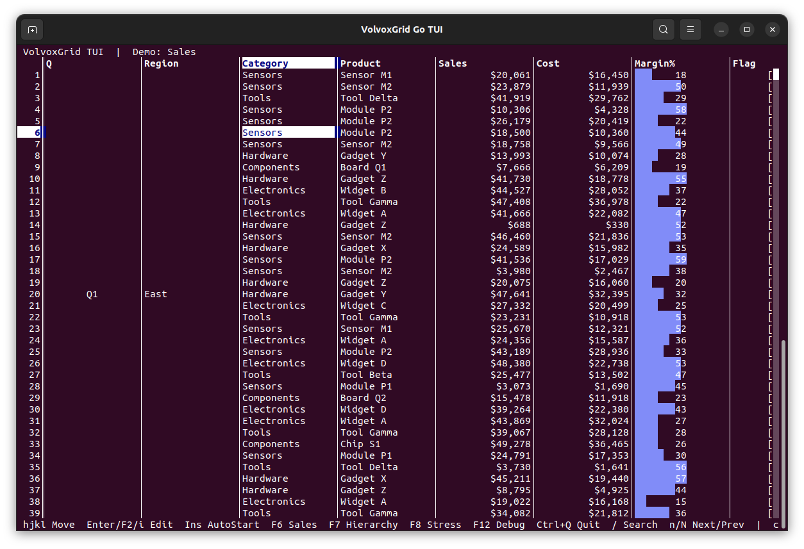

# VolvoxGrid

[](LICENSE)

VolvoxGrid is a pixel-rendered datagrid engine written in Rust. The engine owns layout, selection, editing, sorting, scrolling, merged cells, and rendering, while thin platform wrappers expose it to Android, Java desktop, Flutter, web/WASM, Go, `.NET`, and terminal hosts.

## Screenshots

Checked-in screenshots across the current GUI, mobile, desktop, terminal, and compatibility hosts.

WASM example: <https://volvox-171cc.web.app/demos/web/>

| Web / Wasm | ActiveX / Windows |
|---|---|
|  |  |

| Android | Flutter Android |
|---|---|
|  |  |

| Java Desktop | Java TUI |
|---|---|
|  |  |

| .NET Desktop | .NET TUI |
|---|---|
|  |  |

| Flutter Linux | Go TUI |
|---|---|
|  |  |

## What VolvoxGrid Is

VolvoxGrid is not a single-framework widget. It is a shared grid engine with platform-specific shells on top of it.

The same retained grid model can drive GUI surfaces, terminal hosts, and compatibility adapters, while the platform layer stays focused on windowing, input wiring, packaging, and native lifecycle.

If you are evaluating the rendering paths themselves, read [GUI.md](GUI.md) and [TUI.md](TUI.md). If you are changing VolvoxGrid internals, read [ARCHITECTURE.md](ARCHITECTURE.md).

## Features

### Rendering

- Pixel-rendered GUI engine with CPU and GPU backends (Vulkan, OpenGL ES, WebGPU) and automatic CPU fallback
- Shared Rust engine across Flutter, Android, Java desktop, web/WASM, Go, `.NET`, and terminal hosts
- Thin-host TUI path for ANSI streams or structured cell buffers
- Fling physics scrolling with scrollbar fade animations
- Background images and custom icon themes

### Data

- Cell types: text, numbers, booleans, timestamps, checkboxes (with indeterminate state), progress bars, dropdowns, pictures
- CSV, JSON, and XML import and export
- Formula editing mode with reference highlighting
- Protobuf-based contract and code-generated bindings across all platforms

### Interaction

- Cell editing with IME and international text input support
- Selection modes: free, by row, by column, listbox, multi-range
- Sorting with multi-column and custom comparators
- Search (text and regex) and find
- Clipboard: copy, cut, paste, and delete
- Pull-to-refresh for mobile
- Right-to-left layout support

### Layout

- Merged cells and cell spanning modes
- Frozen rows and columns
- Pinned rows and columns (separate from frozen panes)
- Row and column insert, remove, move, hide, and auto-resize
- Word wrap, shrink-to-fit, and text overflow modes
- Outline and grouping with tree indicators
- Subtotals and aggregates

### Styling

- Per-cell and range-based style overrides
- Column data types and number/date/currency formatting
- Scrollbar modes and debug overlays
- Animation support with configurable duration

### Adapters

- Compatibility adapters for [AG Grid](adapters/aggrid), [Sheet](adapters/sheet), [SfDataGrid](adapters/sfdatagrid), [VSFlexGrid](adapters/vsflexgrid), [XtraGrid](adapters/xtragrid), and [Report](adapters/report) APIs

## Quick Start

### Web

```bash
npm install volvoxgrid
```

```html
<script type="module">
  import { VolvoxGrid } from "volvoxgrid";

  const grid = new VolvoxGrid(document.getElementById("grid"), {
    wasmUrl: "./wasm/volvoxgrid_wasm.js",
    rowCount: 100,
    colCount: 5,
  });

  await grid.loaded;
  grid.setCellText(0, 0, "Hello");
  grid.setCellText(0, 1, "World");
</script>

<div id="grid" style="width: 800px; height: 400px;"></div>
```

Or use the `<volvox-grid>` custom element:

```html
<script type="module">
  import "volvoxgrid/volvoxgrid-element.js";
</script>

<volvox-grid row-count="100" col-count="5"></volvox-grid>
```

### Flutter

```yaml
dependencies:
  volvoxgrid: ^0.6.0
```

```dart
import 'package:volvoxgrid/volvoxgrid.dart';

final controller = VolvoxGridController();
await controller.create(rows: 100, cols: 5);

await controller.setColumnCaption(0, 'Name');
await controller.setColumnCaption(1, 'Price');
await controller.setCellText(0, 0, 'Widget A');
await controller.setCellText(0, 1, '29.99');

// In your widget tree:
VolvoxGridWidget(controller: controller)
```

### Java Desktop

```kotlin
dependencies {
    implementation("io.github.ivere27:volvoxgrid-desktop:0.6.0")
}
```

```java
VolvoxGridDesktopPanel gridPanel = new VolvoxGridDesktopPanel();
frame.add(gridPanel, BorderLayout.CENTER);
gridPanel.initialize(null, 100, 5);

VolvoxGridDesktopController ctrl = gridPanel.createController();
ctrl.setColumnCaption(0, "Name");
ctrl.setCellText(0, 0, "Widget A");
```

## Packages

Examples below use `0.6.0`. Replace it with the release you want to consume.

### Maven / Gradle

Android:

```kotlin
dependencies {
    implementation("io.github.ivere27:volvoxgrid-android:0.6.0")
    // or: implementation("io.github.ivere27:volvoxgrid-android-lite:0.6.0")
}
```

Java desktop:

```kotlin
repositories {
    mavenCentral()
}

dependencies {
    implementation("io.github.ivere27:volvoxgrid-desktop:0.6.0")
}
```

Platform docs:

- [android/README.md](android/README.md)
- [java/README.md](java/README.md)

### Flutter / pub.dev

```yaml
dependencies:
  volvoxgrid: ^0.6.0
```

The Flutter package resolves Android and desktop native binaries from Maven Central at build time. See [flutter/README.md](flutter/README.md).

### Web / npm

```bash
npm install volvoxgrid
npm install @volvoxgrid/ag-grid
npm install @volvoxgrid/sheet
```

See [web/js/README.md](web/js/README.md) for the web package API and [GUI.md](GUI.md) for engine behavior.

### Go

The Go package provides a TUI host and client API for the native plugin. It is not published to a module proxy yet; use it from the repo:

```go
import (
    "github.com/ivere27/volvoxgrid/pkg/volvoxgrid"
    "github.com/ivere27/volvoxgrid/pkg/volvoxgrid/tui"
)
```

See [go/README.md](go/README.md) for setup and usage.

### .NET

The managed wrapper package ID is `VolvoxGrid.DotNet`. The repo currently documents local project and local NuGet flows in [dotnet/README.md](dotnet/README.md):

```bash
dotnet pack dotnet/src/VolvoxGrid.DotNet.csproj -c Release
```

The native `volvoxgrid_plugin` library is still a runtime dependency.

## Documents

- [GUI.md](GUI.md): GUI rendering design and host responsibilities
- [TUI.md](TUI.md): terminal rendering design and host responsibilities
- [ARCHITECTURE.md](ARCHITECTURE.md): repo architecture, build workflow, and VolvoxGrid development
- [CONTRIBUTING.md](CONTRIBUTING.md): contribution guidelines
- [CHANGELOG.md](CHANGELOG.md): project-level changelog
- [android/README.md](android/README.md): Android wrapper usage
- [flutter/README.md](flutter/README.md): Flutter wrapper usage
- [java/README.md](java/README.md): Java desktop wrapper usage
- [dotnet/README.md](dotnet/README.md): `.NET` wrapper usage
- [go/README.md](go/README.md): Go TUI host usage
- [web/js/README.md](web/js/README.md): Web/npm package usage

## Trademarks

AG Grid is a trademark of AG Grid Ltd. Syncfusion and SfDataGrid are trademarks of Syncfusion, Inc. VSFlexGrid and FlexGrid are trademarks of GrapeCity, Inc. (formerly ComponentOne). All other trademarks are the property of their respective owners. VolvoxGrid is not affiliated with or endorsed by any of these companies. Third-party names are used solely to describe API-level interoperability. All adapter code is an independent, clean-room implementation; no source code, binaries, or proprietary assets from the original frameworks are included.

## License

[Apache License 2.0](LICENSE)
