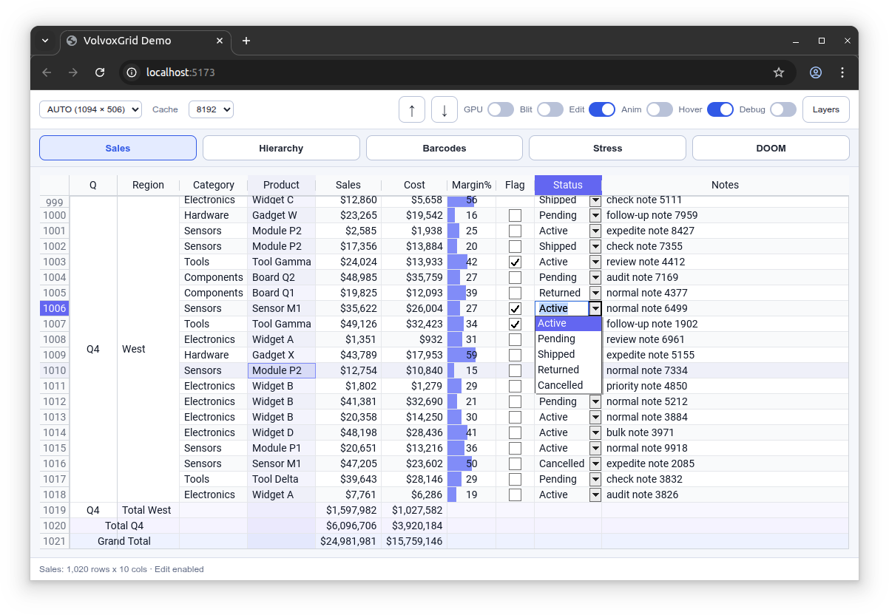
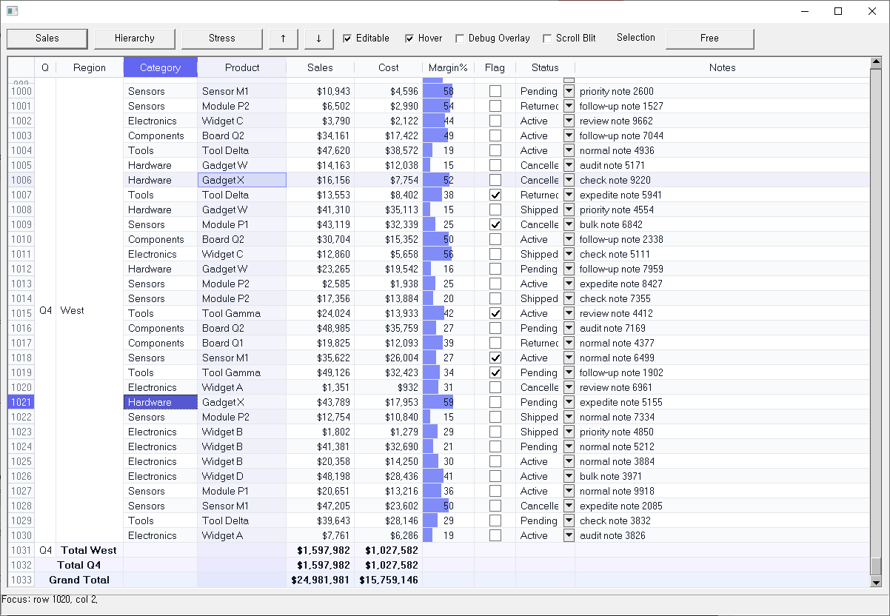
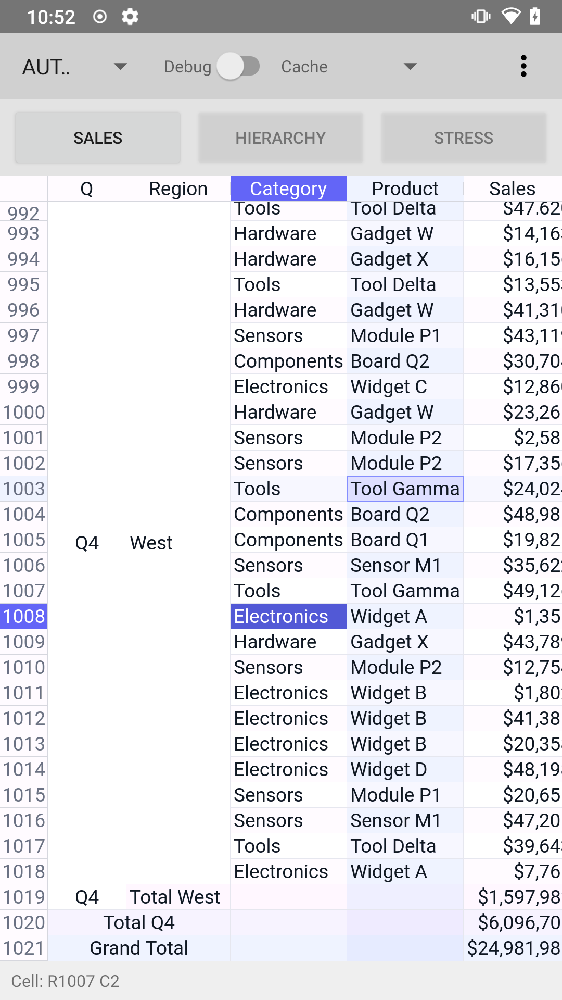
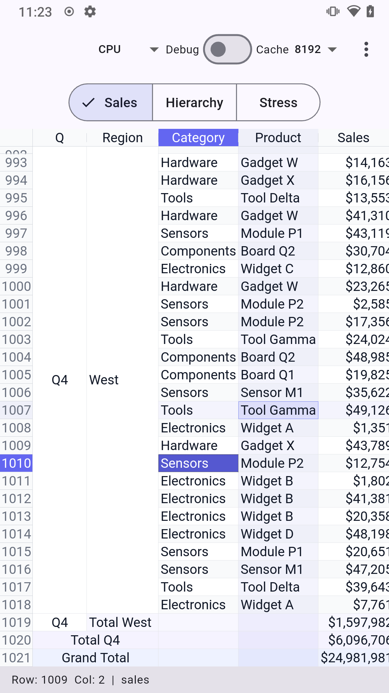
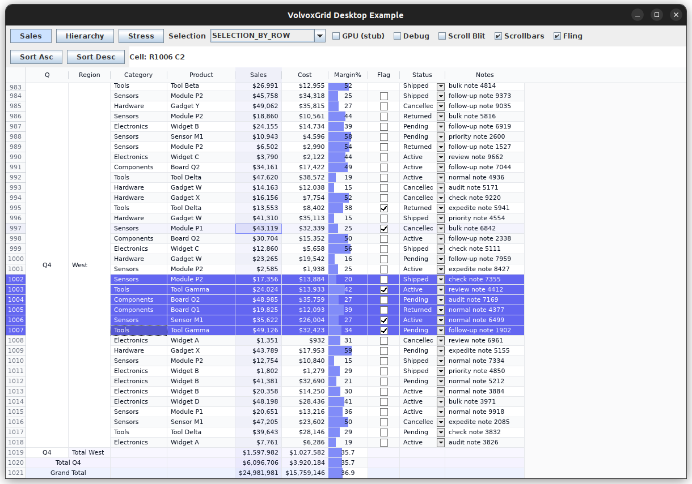
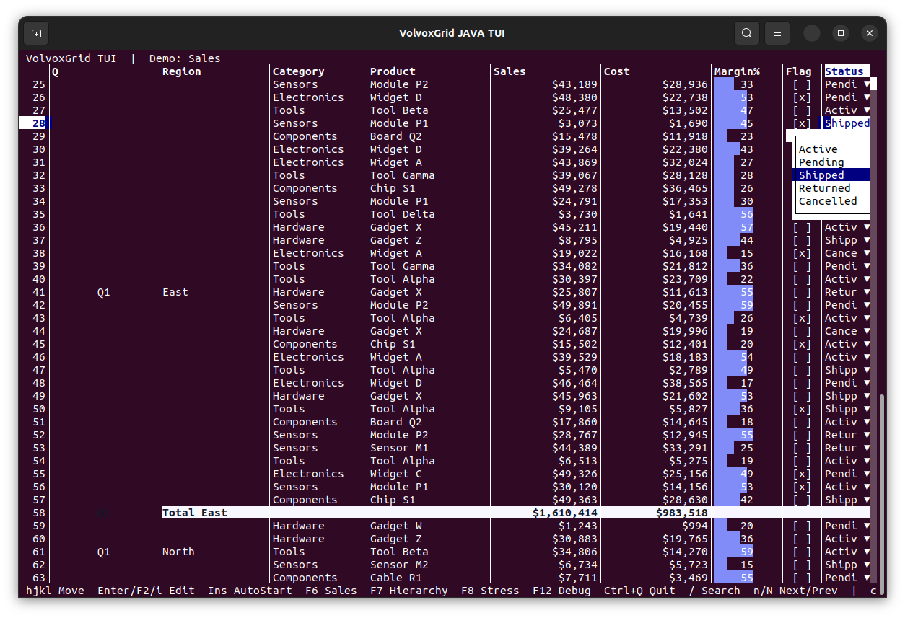
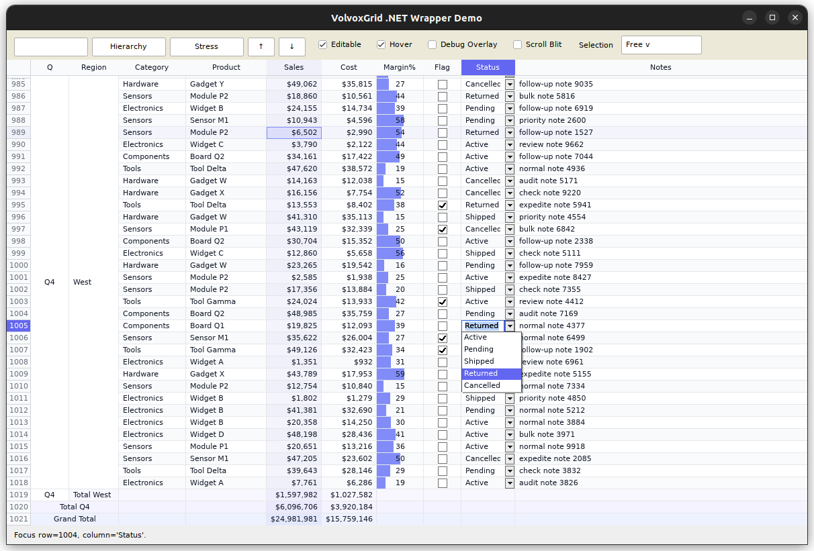
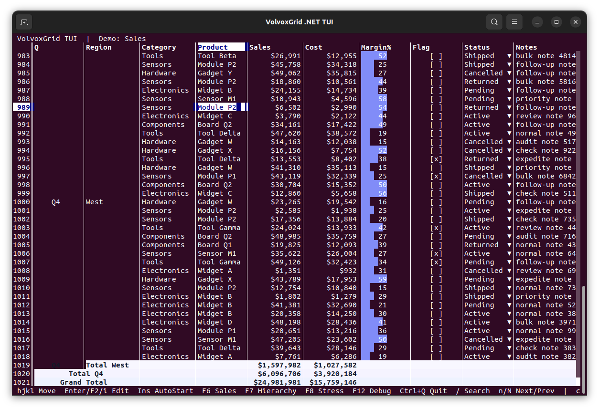
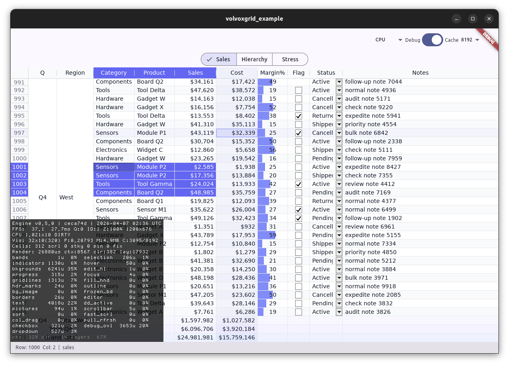
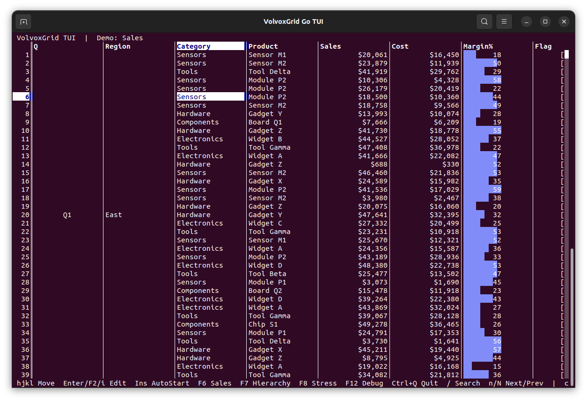

# VolvoxGrid

[](LICENSE)
[](VERSION)

You're shipping a datagrid that has to handle million-row datasets, work across mobile, desktop, web, and terminal, and look the same on every platform. VolvoxGrid is one Rust engine that does that — you bring the host, it brings the pixels.

The engine in `engine/` owns layout, selection, editing, sorting, scrolling, merged cells, and rendering. Thin platform wrappers expose it to Flutter, Android, Java desktop, .NET, Go, Swift, the web (via WASM), and terminal hosts. The grid you ship on Android is the same grid you ship in Chrome — same code, same behavior, same pixels.

## Screenshots

Visual proof across the GUI, mobile, desktop, terminal, and compatibility hosts. Live WASM demo: <https://volvox-171cc.web.app/demos/web/>

| Web / Wasm | ActiveX / Windows |
|---|---|
|  |  |

| Android | Flutter Android |
|---|---|
|  |  |

| Java Desktop | Java TUI |
|---|---|
|  |  |

| .NET Desktop | .NET TUI |
|---|---|
|  |  |

| Flutter Linux | Go TUI |
|---|---|
|  |  |

## Quick start

Three flagship paths. Pick the one that matches what you're building and copy the snippet.

### Web

Install the package, point it at a container, hand it data. The grid loads its WASM on its own.

```html
<script type="module">
  import { VolvoxGrid } from "volvoxgrid";

  const grid = new VolvoxGrid(document.getElementById("grid"), {
    columnDefs: [
      { field: "name", headerName: "Name" },
      { field: "status", headerName: "Status" },
    ],
    rowData: [
      { id: "1", name: "Hello", status: "Ready" },
      { id: "2", name: "World", status: "Queued" },
    ],
    getRowId: ({ data }) => data.id,
  });

  await grid.loaded;
  grid.updateRows([{ id: "2", status: "Done" }]);
</script>

<div id="grid" style="width: 800px; height: 400px;"></div>
```

Notice the `await grid.loaded` — that's WASM init. After that, every call is synchronous from your side. If you'd rather declare the grid in HTML, use the `<volvox-grid>` custom element:

```html
<script type="module">
  import "volvoxgrid/volvoxgrid-element.js";
</script>

<volvox-grid row-count="100" col-count="5"></volvox-grid>
```

Next: [web/js/README.md](web/js/README.md) for the full TypeScript API.

### Flutter

One pub package, one widget, one controller. Native binaries are resolved at build time from Maven Central (Android, desktop) and GitHub releases (iOS XCFrameworks).

```yaml
dependencies:
  volvoxgrid: ^0.8.10
```

Initialize the native runtime once before creating grids:

```dart
import 'package:flutter/widgets.dart';
import 'package:volvoxgrid/volvoxgrid.dart';

Future<void> main() async {
  WidgetsFlutterBinding.ensureInitialized();
  await initVolvoxGrid();
  runApp(const MyApp());
}
```

Then create and render a controller from your widget's async setup:

```dart
import 'package:volvoxgrid/volvoxgrid.dart';

Future<VolvoxGridController> createGridController() async {
  final controller = VolvoxGridController();
  await controller.create(rows: 100, cols: 5);

  await controller.setColumnCaption(0, 'Name');
  await controller.setColumnCaption(1, 'Price');
  await controller.setCellText(0, 0, 'Widget A');
  await controller.setCellText(0, 1, '29.99');
  return controller;
}

// After awaiting createGridController() and storing the controller:
VolvoxGridWidget(controller: controller);
```

The controller talks to the Rust engine over Synurang FFI — you don't see the FFI, just the awaits. Set `VOLVOXGRID_VARIANT=lite` on supported platforms to ship the smaller artifact.

Next: [flutter/README.md](flutter/README.md).

### Java desktop

Drop a Swing panel into your frame, get a controller back, drive the grid from Kotlin or Java.

```kotlin
dependencies {
    implementation("io.github.ivere27:volvoxgrid-desktop:0.8.10")
}
```

```java
VolvoxGridDesktopPanel gridPanel = new VolvoxGridDesktopPanel();
frame.add(gridPanel, BorderLayout.CENTER);
gridPanel.initialize(null, 100, 5);

VolvoxGridDesktopController ctrl = gridPanel.createController();
ctrl.setColumnCaption(0, "Name");
ctrl.setCellText(0, 0, "Widget A");
```

The desktop artifact embeds the native `libvolvoxgrid` for Linux, macOS, and Windows. The lite variant (`volvoxgrid-desktop-lite`) routes text through Java2D instead of the bundled Rust text engine.

Next: [java/README.md](java/README.md).

## Install

Everything in this section uses `0.8.10`. Swap the version for whichever release you're consuming.

### Maven / Gradle (Android, Java desktop)

```kotlin
// Android
dependencies {
    implementation("io.github.ivere27:volvoxgrid-android:0.8.10")
    // or: implementation("io.github.ivere27:volvoxgrid-android-lite:0.8.10")
    // Compose:      implementation("io.github.ivere27:volvoxgrid-android-compose:0.8.10")
    // Compose lite: implementation("io.github.ivere27:volvoxgrid-android-compose-lite:0.8.10")
}

// Java desktop
repositories { mavenCentral() }
dependencies {
    implementation("io.github.ivere27:volvoxgrid-desktop:0.8.10")
    // or: implementation("io.github.ivere27:volvoxgrid-desktop-lite:0.8.10")
}
```

Platform-specific notes live in [android/README.md](android/README.md) and [java/README.md](java/README.md).

### Flutter (pub.dev)

```yaml
dependencies:
  volvoxgrid: ^0.8.10
```

### Swift (SwiftPM)

```swift
dependencies: [
    .package(url: "https://github.com/ivere27/volvoxgrid", from: "0.8.10"),
],
targets: [
    .target(name: "MyApp", dependencies: [
        .product(name: "VolvoxGrid", package: "volvoxgrid"),
    ])
]
```

The `VolvoxGrid` product is the Swift wrapper. Use `import VolvoxGrid`, create `VolvoxGridClient()`, and render with `VolvoxGridView`, `VolvoxGridUIView`, or `VolvoxGridNSView`. The wrapper has no SwiftProtobuf or grpc-swift dependency. Raw binary products are also available as `VolvoxGridXCFramework` and `VolvoxGridLiteXCFramework`. Next: [swift/README.md](swift/README.md).

### Web (npm)

```bash
npm install volvoxgrid
npm install volvoxgrid-lite
npm install @volvoxgrid/ag-grid
npm install @volvoxgrid/sheet
```

The web and adapter packages publish minified `dist/*.min.js` browser bundles for unpkg and jsDelivr in addition to module exports. `volvoxgrid-lite` ships the lite WASM runtime and falls back to Canvas2D for OS/browser fonts — see [TEXT_RENDERING.md](TEXT_RENDERING.md) for the full cache model.

### Go

The Go modules are versioned with path-prefixed tags for the Go module proxy. The core module gives you a typed client over the native library; the Bubble Tea adapter adds a typed TUI component.

```bash
go get github.com/ivere27/volvoxgrid/go@v0.8.10
go get github.com/ivere27/volvoxgrid/adapters/bubbletea@v0.8.10
```

```go
import (
    "github.com/ivere27/volvoxgrid/go/pkg/volvoxgrid"
    "github.com/ivere27/volvoxgrid/go/pkg/volvoxgrid/tui"
)
```

Next: [go/README.md](go/README.md).

### .NET (NuGet)

The managed packages are `VolvoxGrid.DotNet` and `VolvoxGrid.DotNet.Lite`.

```bash
dotnet add package VolvoxGrid.DotNet --version 0.8.10
# or: dotnet add package VolvoxGrid.DotNet.Lite --version 0.8.10
```

The NuGet packages embed staged native libraries for supported RIDs. Project-reference or manual deployment flows still need the native `volvoxgrid` library beside your app or pointed at via `VOLVOXGRID_LIBRARY_PATH`. Full instructions in [dotnet/README.md](dotnet/README.md).

## What's inside

VolvoxGrid is not a single-framework widget — it's a shared grid engine with platform-specific shells.

```
host or adapter  ->  wrapper  ->  runtime or wasm binding  ->  engine
```

The engine in `engine/` is the source of truth. The native runtime in `runtime/` exposes it over Synurang FFI to non-web hosts; `wasm-pack` builds the same engine for the browser. Platform wrappers (`flutter/`, `android/`, `java/`, `dotnet/`, `go/`, `swift/`, `web/js/`) translate native events and surfaces into the shared protobuf contract defined in `proto/`.

If you're changing internals, read [ARCHITECTURE.md](ARCHITECTURE.md). If you're evaluating the rendering paths, read [GUI.md](GUI.md), [TUI.md](TUI.md), and [TEXT_RENDERING.md](TEXT_RENDERING.md).

## Adapters

Compatibility layers in `adapters/` let you keep an existing API while running on the VolvoxGrid engine.

- [aggrid](adapters/aggrid) — drop-in for AG Grid users on the web
- [bubbletea](adapters/bubbletea) — Bubble Tea component for Go TUIs
- [report](adapters/report) — report-style printable output
- [sfdatagrid](adapters/sfdatagrid) — comparison tests against Syncfusion SfDataGrid
- [sheet](adapters/sheet) — spreadsheet-style web API
- [vsflexgrid](adapters/vsflexgrid) — Windows ActiveX control with the legacy VSFlexGrid surface
- [xtragrid](adapters/xtragrid) — DevExpress XtraGrid-shaped API

## Documents

- [GUI.md](GUI.md) — GUI rendering design and host responsibilities
- [TUI.md](TUI.md) — terminal rendering design and host responsibilities
- [BUILD_VARIANTS.md](BUILD_VARIANTS.md) — full vs lite features, artifact types, and binary size
- [TEXT_RENDERING.md](TEXT_RENDERING.md) — full/lite text rendering and cache ownership
- [ARCHITECTURE.md](ARCHITECTURE.md) — repo architecture and build workflow
- [CONTRIBUTING.md](CONTRIBUTING.md) — contribution guidelines and CLA
- [CHANGELOG.md](CHANGELOG.md) — release notes
- [android/README.md](android/README.md), [flutter/README.md](flutter/README.md), [java/README.md](java/README.md), [dotnet/README.md](dotnet/README.md), [go/README.md](go/README.md), [swift/README.md](swift/README.md), [web/js/README.md](web/js/README.md) — per-platform wrapper docs

## Trademarks

AG Grid is a trademark of AG Grid Ltd. Syncfusion and SfDataGrid are trademarks of Syncfusion, Inc. VSFlexGrid and FlexGrid are trademarks of GrapeCity, Inc. (formerly ComponentOne). All other trademarks are the property of their respective owners. VolvoxGrid is not affiliated with or endorsed by any of these companies. Third-party names are used solely to describe API-level interoperability. This repository does not include third-party proprietary source code, binaries, type libraries, or assets.

## License

[Apache License 2.0](LICENSE)
